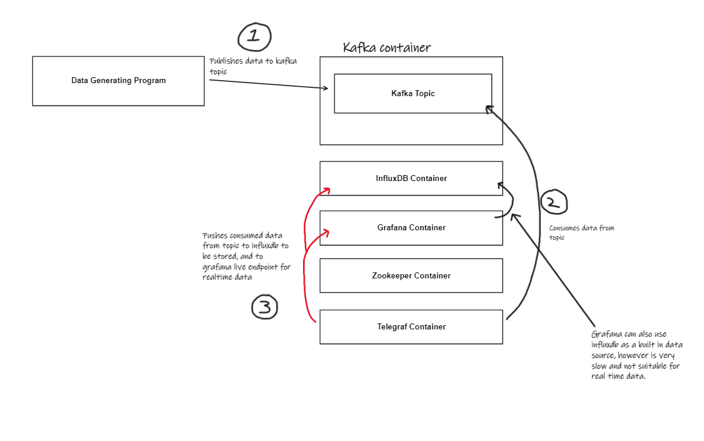
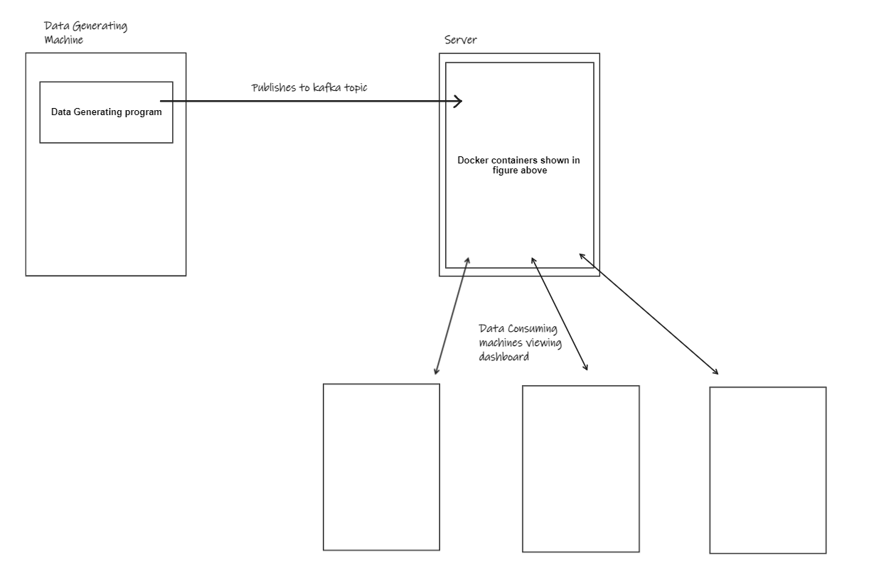

# Computing-project-test
Google drive link of it in action so far: https://drive.google.com/file/d/1z7E0l0UaYGMuljZ5MNp6rFxNvdpKnAle/view?usp=sharing
## Project structure

### Current Structure


### Desired Structure 


### DataGeneratingProgram
DataGeneratingProgram will generate some random numbers and publish them to the kafka topic which in running inside the Kafka container. This is simulating device would be generating telemetry data to be viewed by a dashboard.

### DataReadingProgram
DataReadingProgram will be polling the Kafka topic for new events, simulating the process on the device that will be listening for the telemetry data which can be forwarded on to something like a time series database for storage.


## Depenencies
Confluent.Kafka - https://docs.confluent.io/platform/current/clients/confluent-kafka-dotnet/_site/api/Confluent.Kafka.html

## How to setup influxdb, Kafka and Zookeeper.
To set up all of the infrastructure all you need to do is run the `docker compose up` command in the directory where the `docker-compose.yml` file is located. This will build and run all the nessisary containers needed, as well as configuring them via the environment variables so that everything is ready to be used straight away.

# Influxdb 
## Configuration
The influxdb container is build from the `influxdbDockerfile` file, which simply builds an image from the normal infuxdb docker image while passing in some environment variables needed for the influxdb setup.

Normally when setting up influxdb from the docker image, you need to run the container and go to the web UI to create the inital username, password, organisation, bucket and data retention values. This can also be done via the command line inside the container by running `influx setup`. However, you can also set a number of environment variabes in the container which influxdb will use meaning that you can setup influxdb entirely without any action other than running the container.  

Official documentation can be found here: https://hub.docker.com/_/influxdb

In summary, there are a number of enviroment variables that we are interested in and are needed for the automatic configuration:
DOCKER_INFLUXDB_INIT_MODE           -> Initalisation mode. We set this to `setup`, as we are running a new influxdb setup.
DOCKER_INFLUXDB_INIT_USERNAME       -> The username of the inital user.
DOCKER_INFLUXDB_INIT_PASSWORD       -> The password of the inital user.
DOCKER_INFLUXDB_INIT_ORG            -> The organisation.
DOCKER_INFLUXDB_INIT_BUCKET         -> The name of the first bucket to be created.
DOCKER_INFLUXDB_INIT_RETENTION      -> The length of time data is retained (0 meaning forever).
DOCKER_INFLUXDB_INIT_ADMIN_TOKEN    -> The API token of the user, needed for running commands. (Any authorization errors in the command line can be solved by passing the token into the --token argument)

NOTE: You can pass in a token you've specified via the environment variable which is explained below. If no token is passed in, it will automatically generate one. 

## Passing in your own values to environment variables
Here is an example of running the influxdb container from the command line passing in youre own values. However, more easily you could edit the default values set in the `influxdbDockerfie` file to what you want, save, and run the docker compose.
``` 
docker container run -p 8086:8086 --name InfluxDb -v VOLUME_YOUVE_CREATED:/var/lib/influxdb -e DOCKER_INFLUXDB_INIT_MODE=setup -e DOCKER_INFLUXDB_INIT_USERNAME=admin -e DOCKER_INFLUXDB_INIT_PASSWORD=admin123 -e DOCKER_INFLUXDB_INIT_ORG=example -e DOCKER_INFLUXDB_INIT_BUCKET=TelemetryData -e DOCKER_INFLUXDB_INIT_RETENTION=0 -e DOCKER_INFLUXDB_INIT_ADMIN_TOKEN=TVFyhzXR5g6E4nPxMPY6aUjhXwstDVQlbSTd94k-rOHa3TNyBtE6wnqGbSTqrXvyuGw-cI0hXw6pjVD4u_eejg== influxdb
```
NOTE: Subsitute `VOLUME_YOUVE_CREATED` with the name of a volume you have created via the `docker volume create VOLUME_NAME` command.

Once the container is setup and you want to view the web UI, you can navigate to `localhost:8086`.

## Writing to influxdb via the command line.
The format for writing to influxdb is "(required)measurementName host (requred)key=value timestamp(unix time)"
There is some other information needed in the command which are passed as arguments and are:
--bucket        -> Name of bucket to write to
-o              -> Name of the organistaion
--token         -> Token of user needed for authorization

Some Example commands:
```
influx write --bucket test -o test  --token mGKNA3ucyOT2rnIuxmGYQAbnrYkBGaT0Piiotl2AFurXVbCl8ExjRok5I9IKI5f94prJziCGSezz7J_JQUGkBg== "SteeringAngle,host=Car value=80"
influx write --bucket test -o test  --token mGKNA3ucyOT2rnIuxmGYQAbnrYkBGaT0Piiotl2AFurXVbCl8ExjRok5I9IKI5f94prJziCGSezz7J_JQUGkBg== "SteeringAngle value=1 1556813561098000000"
```

# Zookeeper
## Configuration
Zookeeper is very simple to get running, refer to the docker compose for what ports and environment variables that are passed in.

# Kafka
## Configuration

Similar to influxdb, to set up Kafka there are a number of environment variables that can be set that Kafka will use for its configuration. All of these are set in the docker compose file and will be explained below.

Here is the docker compose for the Kafka container:
```
kafka:
    image: wurstmeister/kafka
    depends_on:
      - zookeeper
    ports:
      - "9092:9092"
    expose:
      - "9093"
    environment:
      KAFKA_BROKER_ID: 1
      KAFKA_ZOOKEEPER_CONNECT: zookeeper:2181
      KAFKA_LISTENERS: INSIDE://0.0.0.0:9093,OUTSIDE://0.0.0.0:9092
      KAFKA_ADVERTISED_LISTENERS: INSIDE://kafka:9093,OUTSIDE://localhost:9092
      KAFKA_LISTENER_SECURITY_PROTOCOL_MAP: INSIDE:PLAINTEXT,OUTSIDE:PLAINTEXT
      KAFKA_INTER_BROKER_LISTENER_NAME: INSIDE
      KAFKA_OFFSETS_TOPIC_REPLICATION_FACTOR: 1
      KAFKA_CREATE_TOPICS: "TelemetryData:1:1"
```

### Here are the explanations for the following commands:

```
ports:
      - "9092:9092"
```
This is mapping port 9092 of the container to port 9092 of the host machine. This will allow the kafka broker inside the container to communicate with processes on the host machine.

```
expose:
      - "9093"
```
This is exposing port 9093 inside the container, which will be used for processes inside the container to communicate with the kafka broker on a port different to the port processes use outside the container.

```
KAFKA_LISTENERS: INSIDE://0.0.0.0:9093,OUTSIDE://0.0.0.0:9092
```
This is a comma seperated list of listener names, port and host/IP address that Kafka will bind to for listening

```
KAFKA_ADVERTISED_LISTENERS: INSIDE://kafka:9093,OUTSIDE://localhost:9092
```
This is a comma seperated list of listener names, port and host/IP address that the clients used to connect to the Kafka broker(s).
In this case inside the container the clients will connect to kafka:9093 (the port exposed earlier to facilitate communication inside the container) and localhost:9092 which clients outide the container will connect to (which we also mapped earlier).

```
KAFKA_LISTENER_SECURITY_PROTOCOL_MAP: INSIDE:PLAINTEXT,OUTSIDE:PLAINTEXT
```
Security protocol used by each listener name. Set to plaintext for simplicity but could be SSL, etc.

```
KAFKA_INTER_BROKER_LISTENER_NAME: INSIDE
```
Defines which listener to use for inter-broker communication. Since the brokers in this container will be "inside" the container, this should the inside listener.

```
KAFKA_OFFSETS_TOPIC_REPLICATION_FACTOR: 1
```
Since there is just one Kafka broker, we have to set the replication factor to 1 as there are no other brokers replicate any partitions to.

```
KAFKA_CREATE_TOPICS: "TelemetryData:1:1"
```
Automatically creates a topic called TelemetryData with 1 partition and 1 replica. 


# How to write to the kafka topic.
When Kafka is setup, you can publish and consume to and from the Kafka broker in the same way you would do any other way, you just have to ensure that you have the correct host/IP address and port in the "--broker-list" argument of the bat/shell files, or "BootstrapServers" in the case of using the Confluent.Kafka NuGet package.

# Telegraf
## What is Telegraf?
"Telegraf is an open source plugin-driven server agent for collecting and reporting metrics"
In this case, Telegraf is used two things. Firstly for collecting the data published to the Kafka topic, and then distributing that to other applications such as influxdb to be stored into the time series database, and more importantly for "real-time" telemetry, outputting to a web socket. Both of these can be done at the same time ensuring that data can be viewed in real time but is also being stored so historical analysis can be done.

## Configuration
The configuration for telegraf in the docker compose is relatively simple. The only aspect to it other than the docker compose is the `telegraf.conf` file which is the configuration file for telegraf. Having a look in the config file for this you can see telegraf outputs to influxdb_v2 (`[[outputs.influxdb_v2]]`), has input from the Kafka topic (`inputs.kafka_consumer`), and also outputs to a web socket (`[[outputs.websocket]]`). As mentioned above, outputting to the web socket means that you can view data almost real-time, which is not the case when using the influxdb or grafana dashboard as its data source. In the stage of current development the output web socket goes to grafana live which will be explained below.

### Note: Telegraf sometimes has trouble with connecting to Kafka after running the docker compose (Kafka not ready by the time Telegraf is done?), a workaround to this is to just manually restart the Telegraf container.

# Grafana Live
## What is grafana live?
Grafana is an app where you can configure dashboards that pull information data sources which so that you can view lots of different metrics or logs. Grafana Live is a real-time messaging engine introduced in Grafana v8.0. where it sends data to clients over a persistent WebSocket connection. A Grafana frontend subscribes on channels to receive data which was published into that channel.

https://grafana.com/docs/grafana/latest/setup-grafana/set-up-grafana-live/
https://grafana.com/tutorials/stream-metrics-from-telegraf-to-grafana/

Once Telegraf has been configured to output to a web socket and has been configured to use the Grafana web socket endpoint, you need to log into Grafana and setup an API token which is needed in the Telegraf configuration for the web socket. From there you need to then set up a new dashboard in Grafana and set the data source to "-- Grafana --", then choose the "Live Measurement" query type, and then select the "stream/custom_stream_id/kafka_consumer" Channel to start consuming the real time data that is being outputted from Telegraf.

### Note: Currently looking into streamlining the Grafana setup to be as easy as possible like the other applications.